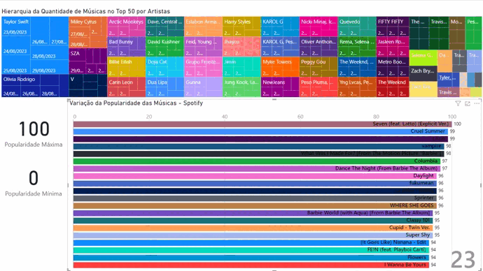

# Spotify Top 50 Playlist Data Pipeline

Este projeto utiliza o [Apache Airflow](https://airflow.apache.org) para criar uma pipeline de dados que coleta informações sobre as 50 músicas mais populares na playlist oficial do Spotify denominada Top 50 - Mundo. A pipeline é responsável por extrair dados essenciais de cada música, como o nome da faixa, os artistas envolvidos e sua pontuação de popularidade.

## Pré-requisitos
Antes de executar este DAG, você precisa configurar algumas coisas:

1. **Conta de Desenvolvedor do Spotify**: Você deve ter uma conta de desenvolvedor do Spotify e criar uma aplicação para obter o *CLIENT_ID* e o *CLIENT_SECRET* para autenticação.

2. **Configuração do Airflow**: Certifique-se de ter o Apache Airflow instalado e configurado.

3. **Variáveis do Airflow**: Defina as seguintes variáveis do Airflow:
    - **CLIENT_ID**: O ID do cliente da sua aplicação Spotify.
    - **CLIENT_SECRET**: O segredo do cliente da sua aplicação Spotify.
    - **PLAYLIST_NAME**: O nome da playlist do Spotify da qual você deseja coletar dados.

## Estrutura do DAG
Este DAG executa as seguintes tarefas:

1. **Tarefa de Verificação e Criação de Arquivo**: Verifica se o arquivo CSV para armazenar os dados (spotify_Top50_infos.csv) existe. Se não existir, cria o arquivo com o cabeçalho necessário.

2. **Tarefa de Obtenção de Token**: Recupera um token de acesso do Spotify usando o *CLIENT_ID* e o *CLIENT_SECRET* fornecidos. Esse token é necessário para acessar a API do Spotify.

3. **Tarefa de Criação de Cabeçalho de Autenticação**: Constrói o cabeçalho de autorização usando o token de acesso obtido na etapa anterior.

4. **Tarefa de Pesquisa de ID**: Procura a playlist do Spotify especificada na variável *PLAYLIST_NAME* e recupera seu ID exclusivo.

5. **Tarefa de Pesquisa de Informações**: Recupera informações sobre as músicas da playlist. Em seguida, anexa esses dados ao arquivo CSV.

## Análise de Dados com Power BI

O [Power Bi](https://powerbi.microsoft.com/pt-br/) é utilizado para analisar a composição da playlist **Top 50 - Mundo** e entender quais artistas têm o maior número de músicas presentes. Além disso, o Power BI permite criar uma visualização dinâmica que rastreia a variação das músicas na playlist ao longo do tempo, com base em sua popularidade, por meio do Gráfico de Corrida de Barras Animado.

